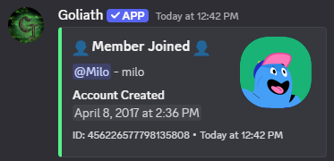

# Audit Log Settings
Configuration for guild audit log messages.

## /auditlogsettings memberjoinleave
You can have a message be sent to the **Audit Member Join/Leave Channel** when a member joins or leaves the server, this is disabled by default and gets enabled when a channel is selected.

:::info
Green is shown for joins, red is shown when a member leaves.

:::

## /auditlogsettings punishments
You can have a message be sent to the **Audit Punishments Channel** when a member is punished, this is disabled by default and gets enabled when a channel is selected.

:::info
Green is shown when a member is unbanned or had their timeout removed and red is shown when a member is banned or is timed out.

:::

## /auditlogsettings voicestates
You can enable or disable the audit log for Voice State changes, this is disabled by default and gets enabled when a channel is selected.

A message is sent to the **Audit Voice State Channel** when a user joins or leaves a voice channel or when they move between channels.

:::info
Green is shown for joins, red is shown for leaves, and yellow is shown for moves.

:::