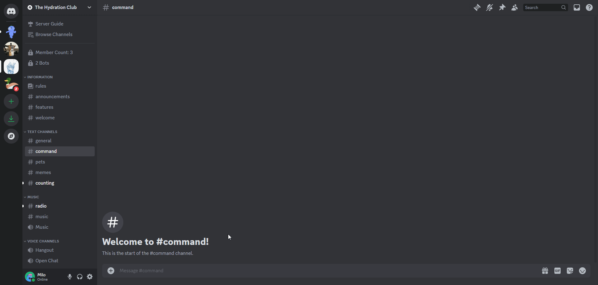

# Goodbye Settings
Configuration for goodbye message, cards, and join roles.

## /goodbyesettings
To access all of the settings related to Goodbye Messages, Cards, and Join Roles, type the `/goodbyesettings` command.

From there, select the first dropdown to switch to which setting you are trying to change.

:::info
At any point, you can preview the Goodbye Message by running `/previewjoinleave goodbye`

:::

## Goodbye Channel
Select the text channel that is used to greet new users to the guild. This will send the message defined in Goodbye Message to the channel, along with a generated Goodbye Card image if enabled.

:::warning
Make sure Goliath has permission to send messages (and attachments if you have the Goodbye Card enabled) to the channel.
:::

## Webhook User
You can select a user that will be displayed in a [Webhook](https://support.discord.com/hc/en-us/articles/228383668-Intro-to-Webhooks) to goodbye new users.

:::warning
Make sure Goliath has permission to Manage Webhooks.
:::

## Goodbye Message
You can customize a message that will be sent to the Goodbye Channel when a user joins the server. Click the button to enter text then type the message you would like to send in the Modal.

Default: `**{user.name}** just left the server`

:::info[Text Variables]
All message fields support some additional text variables that will be replaced when sent:
- `{user}`: Replaced with the user's mention.
- `{user.name}`: Replaced with the user's nickname, global name, or username (whichever comes first).
- `{user.id}`: Replaced with the user's id.
- `{user.nth_member}`: Replaced with the ordinal number for the member. (1st, 2nd, etc.)
- `{guild.name}`: Replaced with the guild's name.
- `{guild.id}`: Replaced with the guild's id.
- `{guild.member_count}`: Replaced with the guild's member count.

These text variables are also used in the Goodbye Card Title and Card Subtitle.
:::

## Goodbye Card
Optionally, you can enable a Goodbye Card that is generated and sent with the Goodbye Message. It is disabled by default.

### Card Title
You can change the title in the goodbye card (it's the first line of text).

Default: `{user.name} just left the server`

:::info
Markdown is **not** supported in any of the Goodbye Card fields BUT Text Variables are.
:::

### Card Title Color
Change the title's text color. This field only accepts HEX color codes (e.g., #FFFFFF or #FFFFFFB3).

Default: `#FFFFFF`

### Card Subtitle
Change the subtitle in the goodbye card (it's the second line of text).

### Card Subtitle Color
Change the subtitle's text color. This field only accepts HEX color codes (e.g., #FFFFFF or #FFFFFFB3).

Default: `#FFFFFFB3`

### Card Avatar Border
You can enable or disable a colored border that is around the user's profile picture in the card.

Default: `Enabled`

### Card Avatar Border Color
Change the color of the outline around the user's profile picture.

Default: `#0CA7FF`

### Card Background Color
Change the base background color of the card.

Default: `#17181D`

### Card Background Image
You can add a custom background image for the card, this will override any colors selected for the background or extra style. This field only accepts URLs that link directly to an image - you can upload an image to Discord, copy the link, then paste it in the Modal.

The Card Overlay color will become slightly transparent.

:::info
Recommended dimensions are **1100px by 500px**.
:::

### Card Overlay Color
Change the base overlay color (where the user's avatar and text is) of the card.

Default: `#070609`