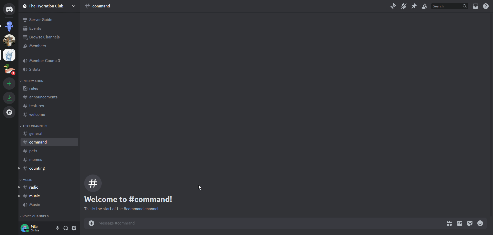

# General Server Settings
Basic server configuration for Goliath.

## /serversettings
To access the menu and edit the Server Settings, run the `/serversettings` command.

## Member Count Channel
A Voice Channel can be selected to include an updating count of Members in your server (this does not count Apps). Simply create a channel, run the `/serversettings` command, and select the channel you created for the "Member Count Channel" option.

For example, if you create a channel named `Member Count: 0` and select that channel in the command, it will automatically update the channel name as new members join. The channel name **must** include a number.

:::info
Discord has a strict rate limit for updating channel names. A channel name can only be updated by an App **twice** per **ten minutes**. If your member count is falling behind, it could be because the bot has already updated the channel name twice within ten minutes.
:::

## Bot Count Channel
A Voice Channel can be selected to include an updating count of Apps (bots) in your server. Simply create a channel, run the `/serversettings` command, and select the channel you created for the "Bot Count Channel" option.

## Counting Channels
Multiple Text Channels can be selected for the Counting Minigame that is in Goliath. Simply create a text channel (or multiple), run the `/serversettings` command, and select the channel(s) you want to be for counting.

Goliath will react to messages with a ✅ for numbers that are correctly sent in a sequence and a ❌ for numbers that are incorrectly sent in a sequence.

:::info
Regular messages sent in these channels are simply ignored and messages sent my other apps (including numbers) are not counted.
:::