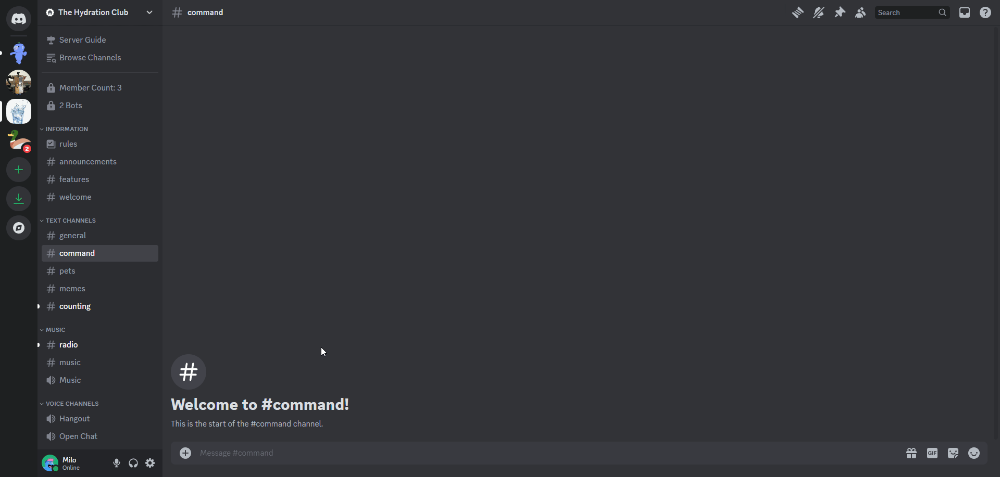
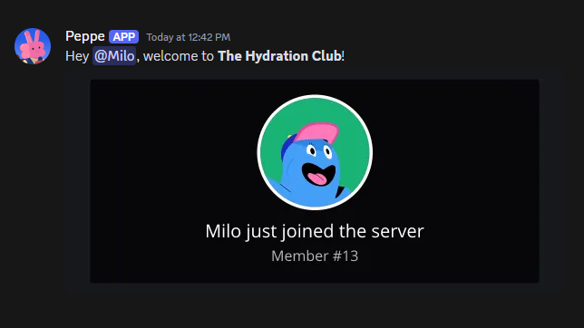
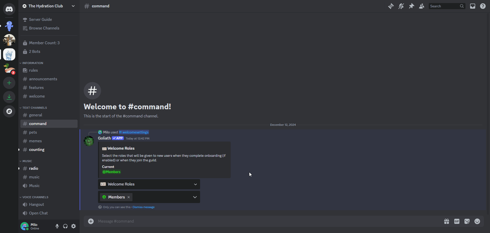

# Welcome Settings
Configuration for welcome message, cards, and join roles.

## /welcomesettings
To access all of the settings related to Welcome Messages, Cards, and Join Roles, type the `/welcomesettings` command.

From there, select the first dropdown to switch to which setting you are trying to change.

:::info
At any point, you can preview the Welcome Message by running `/previewjoinleave welcome`

:::

## Welcome Roles
You can give users roles when they join you server or when they complete [Onboarding](https://support.discord.com/hc/en-us/articles/11074987197975-Community-Onboarding-FAQ) if it is enabled. 

To do so, in the second dropdown, select which roles you would like to give new users, and click outside of the dropdown to confirm. The embed should update to show the current roles that will be given to new users.

:::warning
Make sure Goliath has a role that is higher than the roles you are trying to give members AND that Goliath has permission to Manage Roles otherwise roles will not be given to new users.
:::

## Welcome Channel
Select the text channel that is used to greet new users to the guild. This will send the message defined in Welcome Message to the channel, along with a generated Welcome Card image if enabled.

:::warning
Make sure Goliath has permission to send messages (and attachments if you have the Welcome Card enabled) to the channel.
:::

## Webhook User
You can select a user that will be displayed in a [Webhook](https://support.discord.com/hc/en-us/articles/228383668-Intro-to-Webhooks) to welcome new users.

:::warning
Make sure Goliath has permission to Manage Webhooks.
:::

## Welcome Message
You can customize a message that will be sent to the Welcome Channel when a user joins the server. Click the button to enter text then type the message you would like to send in the Modal.

Default: `Hey {user}, welcome to **{guild.name}**!`

:::info[Text Variables]
All message fields support some additional text variables that will be replaced when sent:
- `{user}`: Replaced with the user's mention.
- `{user.name}`: Replaced with the user's nickname, global name, or username (whichever comes first).
- `{user.id}`: Replaced with the user's id.
- `{user.nth_member}`: Replaced with the ordinal number for the member. (1st, 2nd, etc.)
- `{guild.name}`: Replaced with the guild's name.
- `{guild.id}`: Replaced with the guild's id.
- `{guild.member_count}`: Replaced with the guild's member count.

These text variables are also used in the Welcome Card Title and Card Subtitle.
:::

## Welcome Card
Optionally, you can enable a Welcome Card that is generated and sent with the Welcome Message. It is disabled by default. It looks like this:

### Card Title
You can change the title in the welcome card (it's the first line of text).

Default: `{user.name} has joined the server`

:::info
Markdown is **not** supported in any of the Welcome Card fields BUT Text Variables are.
:::

### Card Title Color
Change the title's text color. This field only accepts HEX color codes (e.g., #FFFFFF or #FFFFFFB3).

Default: `#FFFFFF`

### Card Subtitle
Change the subtitle in the welcome card (it's the second line of text).

Default: `Member #{guild.member_count}`

### Card Subtitle Color
Change the subtitle's text color. This field only accepts HEX color codes (e.g., #FFFFFF or #FFFFFFB3).

Default: `#FFFFFFB3`

### Card Avatar Border
You can enable or disable a colored border that is around the user's profile picture in the card.

Default: `Enabled`

### Card Avatar Border Color
Change the color of the outline around the user's profile picture.

Default: `#0CA7FF`

### Card Background Color
Change the base background color of the card.

Default: `#17181D`

### Card Background Image
You can add a custom background image for the card, this will override any colors selected for the background or extra style. This field only accepts URLs that link directly to an image - you can upload an image to Discord, copy the link, then paste it in the Modal.

The Card Overlay color will become slightly transparent.

:::info
Recommended dimensions are **1100px by 500px**.
:::

### Card Overlay Color
Change the base overlay color (where the user's avatar and text is) of the card.

Default: `#070609`