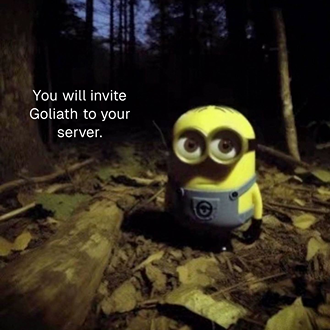

# Meme Generation Commands
Commands for generating memes.

## /cursedminion
The `/cursedminion` command will generate a meme with a cursed minion and your inputted text.

:::info[Example]

:::

## /tradeoffer
The `/tradeoffer` command is used to generate a trade offer meme. It accepts a message shown under the "i recieve" and the "you receive" texts.

:::info[Example]

:::