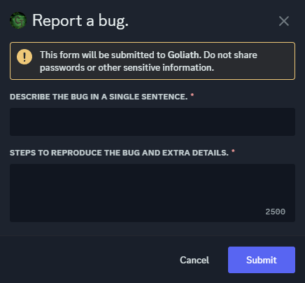

# Bug Reporting
Reporting bugs and issues with Goliath you encounter.

## /bugreport
You can report bugs or issues that you find by running the `/bugreport` command. This will send us a message and we'll be able to take a look - we won't reach out to you directly if the bug is fixed, but if we need extra details we might.

You'll need to describe the bug in a single sentence (100 characters) then add steps to reproduce and any extra details to help us figure out what went wrong.

:::info
If you need to attach a video or screenshots, you can either send it as a link or join our [Support Server](https://support.goliath.bot) and send it to us there.
:::