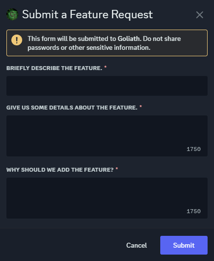

# Feature Requests
Submit feature requests to suggest new things to be added to Goliath.

## /featurerequest
You can suggest new things to be added to Goliath by running the `/featurerequest` command.

You'll need to describe the feature in a sentence, give some extra details about how it should work, then explain why we should add it.

:::info
If you need to attach a video or screenshots, you can either send it as a link or join our [Support Server](https://support.goliath.bot) and send it to us there.
:::