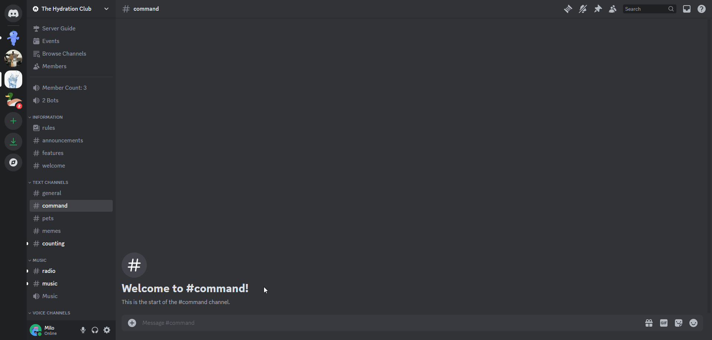

import UserTimeZone from './scripts/UserTimeZone';

# User Timezones
The `/timezone` command allows you to set your own timezone or view another user's current time.

## /timezone get
You can use `/timezone get <user>` to view the current time of a specific user. (This information is also shown in `/profile`)

## /timezone set
You can set your own timezone using `/timezone set <timezone>`. 

The timezone list autocompletes, so if you don't see your timezone, try finding the closest timezone that is the same as yours.

:::info
You can easily find your timezone by visiting [TimeZoneDB's Demo Map](https://timezonedb.com/).
<UserTimeZone />
:::

## /timezone clear
You can clear your timezone by using `/timezone clear`.