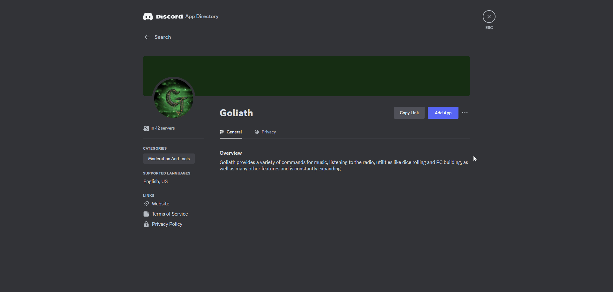

# Getting Started

A multi-purpose Discord bot packed with various features to improve your server.

:::tip
As Goliath is constantly being updated, the documentation may be out of date or subject to change. You are welcome to contribute on the [GitHub Repository](https://github.com/GoliathBot/docs.goliath.bot).
:::

## Adding Goliath

To get started, you can either head to [https://invite.goliath.bot](https://invite.goliath.bot) or go to the [App Directory](https://discord.com/application-directory/694640263074807909) page for Goliath and clicking the **Add App** button.

### Adding to a Guild

You can add Goliath by clicking the **Add to Server** button on either the Invite page or App Directory page, from there select a server from the dropdown, click the **Continue** button, then **Authorize**.

:::warning[Permissions Required to Function]
Make sure you keep all of the selected permissions, Goliath relies on the permissions to handle things around the server.
:::

### Adding to your Account
Some commands are accessible not only through a server, but also through your account and can be used in a DM with Goliath, other Private Messages, Group DMs, or other servers you have the [Use Externals Apps](https://support-apps.discord.com/hc/en-us/articles/26501864012951-Moderating-Apps-on-Discord#h_01HZQQQEAD1NCVP0MB1VQXV5C0) permission in.

:::info
You can add Goliath to your account by clicking the **Add to My Apps** button on either the Invite page or App Directory page, then clicking **Authorize**.

:::

## Commands and Features

A list of commands can be found by typing the `/help` slash command, they are sorted into categories that will reflect the categories shown on the sidebar.

:::info
All of Goliath's main commands utilize slash commands, there is no prefix to set.
:::

### Support

We offer support in our [Support Discord Server](https://support.goliath.bot), feel free to join and ask us for help.

If you encounter a bug and would like to report it **without** joining our server, run the `/bugreport` command and fill out the required information.

### Feature Requests

We're always open to hear your feedback! You can either chat with us in our [Support Server](https://support.goliath.bot) or submit a feature request by running the `/featurerequest` command and filling out the information.