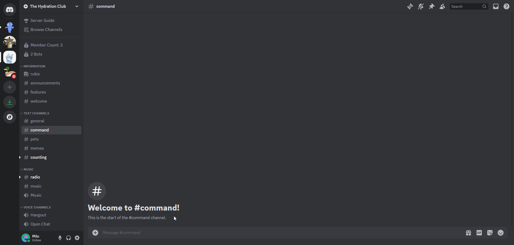

# Announcement Builder
Sending custom announcements with embeds to channels.

## /announce
The `/announce` command allows you to build embeds to send to channels with a variety of options.

## Options

### Type
You can choose between a Regular Announcement which sends the embed as Goliath or a Webhook Announcement which allows you to choose a user that the App will look like.

### Title
A title can be added which is shown at the very top of the embed, they can be a maximum of 256 characters long.

### Description
Descriptions are shown below titles and can be a maximum of 4096 characters long.

:::info
Either a title or description is required for an announcement to be sent.
:::

### Footer
Footer text is optional but shows at the very bottom of the embed below everything else and can be a maximum of 2048 characters long.

### Color
You can input a HEX color code to use for the color of the embed.

### Image
You can either use the `image-url` option to input an image URL or `image-attachment` to attach an image to be shown in the main section of the embed.

:::info
You can only use one of the options, either `url` or `attachment`, not both.
:::

### Thumbnail
You can either use the `thumbnail-url` option for a URL or `thumbnail-attachment` to attach an image to be shown on the top right of the embed.

### URL
You can make the title of the embed a clickable link by inputting a URL in the `url` option.

### Role
If you would like to mention a role when the announcement is sent, you can select a role to ping in the `role` option.

### Timestamp
You can show an additional timestamp in the footer by setting the `timestamp` option to `True`.

### User
This option is specific to the **Webhook Announcement** type and is used to change the user that the Webhook will look like.

:::info
If no user is selected when using the **Webhook Announcement** type, by default the webhook will copy the look of your avatar and nickname.
:::