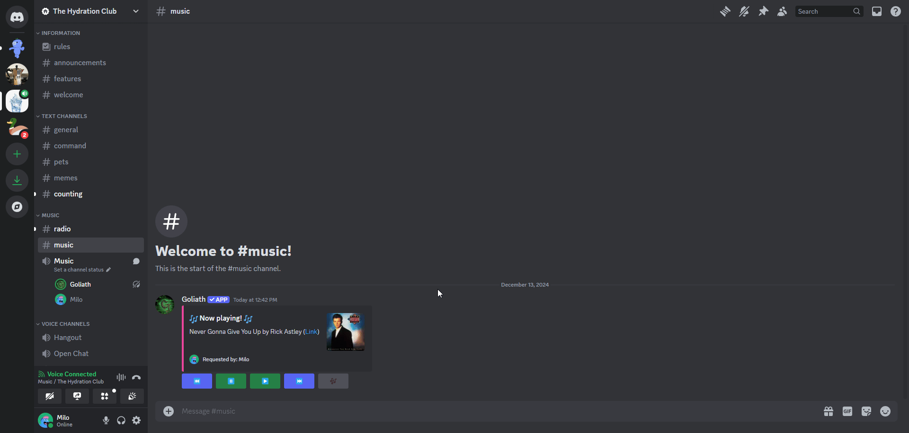
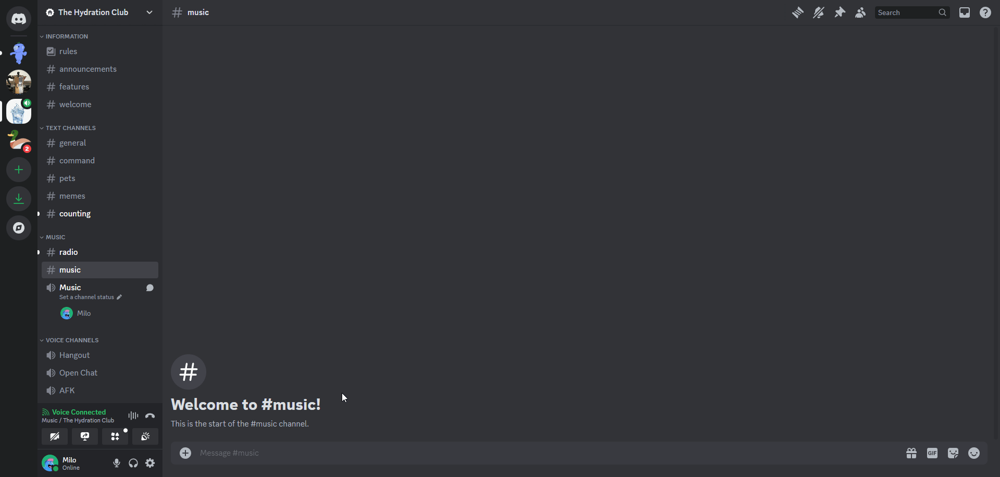
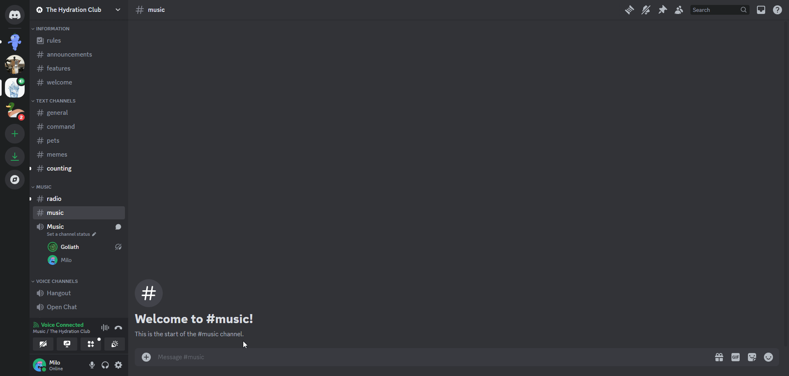

# Playback Control
How to listen to music and add tracks to the queue.

## /autoplay
You can enable autoplay by running the `/autoplay on` command. You can disable autoplay by running `/autoplay off`.

:::info
Autoplay will automatically add new songs to the queue based on the songs in the queue.
:::

## /pause
You can pause the music by running the `/pause` command or by clicking the pause button.

## /play
You can easily search for music by running the `/play <query>` command and typing in the name of the song or artist you want to search for.

You can also input a link to a song or playlist to play it.

## /previous
You can go back to the previous song by running the `/previous` command or by clicking the previous button.

## /repeatmode
You can change the repeat mode by running the `/repeatmode <mode>` command and typing in the mode you want to change to. To turn off repeat mode, run `/repeatmode off`.

The available repeat modes are:
- `queue` - Repeat the entire queue.
- `track` - Repeat the current track.

:::info
If you want to know what the current repeat mode is, run `/repeatmode get`.
:::

## /resume 
You can resume the music by running the `/resume` command or by clicking the resume button.

## /seek
You can seek to a specific point in the song by running the `/seek <time>` command and typing in where you want to seek.

:::info
The seek command accepts seconds, minutes, and hours in the format `HH:MM:SS`. For example, `/seek 1:30` will seek to 1 minute and 30 seconds into the song.

You can also use only seconds to seek to a specific second in the song. For example, `/seek 65` will seek to 1 minute and 5 seconds into the song.
:::

## /skip
You can skip the current song by running the `/skip` command or by clicking the skip button.

## /skipto
You can skip to a specific song in the queue by running the `/skipto <song>` command and typing in the number of the song you want to skip to.

:::info
The `/skipto` command autocompletes all of the songs in the queue, you can skip to a song in the queue by clicking on it in the autocomplete list.
:::

## /volume
You can change the volume by running the `/volume <volume>` command and typing in the volume you want to change to.