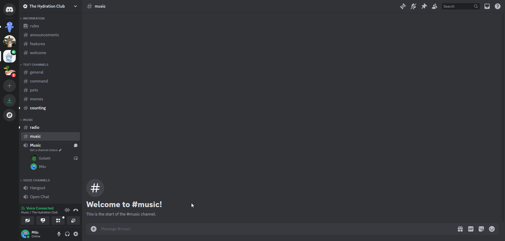
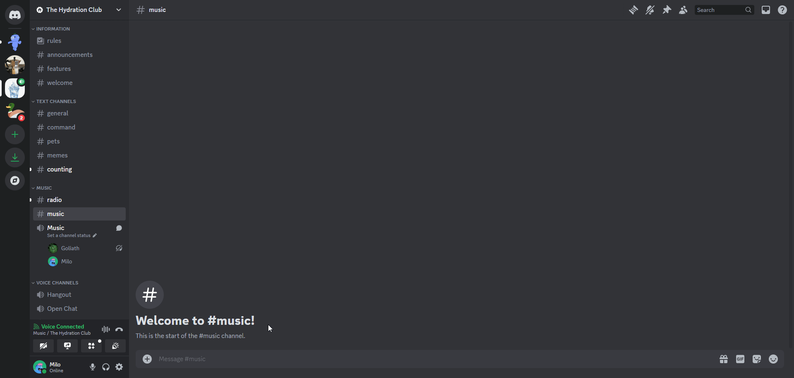

# Queue Management
Commands for managing the music queue.

## /clearqueue
The `/clearqueue` command clears all of the songs in the queue.

## /jumpto
The `/jumpto <song>` command jumps to a specific song in the queue by typing in the number of the song you want to jump to.

## /leave
You can force Goliath to leave the voice channel by running the `/leave` command.

:::warning
This will also remove all of the songs in the queue.
:::

## /move
The `/move <song> <new position>` command moves a song in the queue by typing in the number of the song you want to move and the new position you want to move it to.

## /queue
The `/queue` command displays the current queue of songs in the queue.

## /remove
The `/remove <song>` command removes a song from the queue by typing in the number of the song you want to remove.

## /shuffle
You can shuffle all of the songs in the queue by running the `/shuffle` command.

## /swap
The `/swap <song 1> <song 2>` command swaps two songs in the queue by typing in the numbers of the songs you want to swap.
