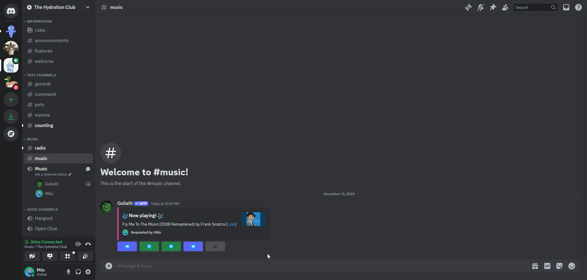
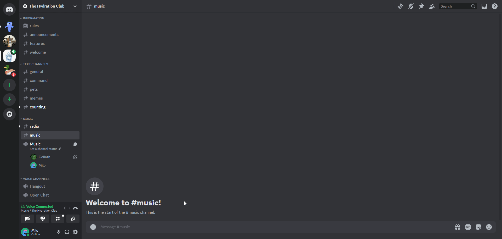

# Song Information
Commands for getting information about songs.

## /lyrics
You can get the lyrics of the current song by running the `/lyrics` command.

:::info
If you want to get the lyrics of a specific song, you can use the `/lyrics <song>` command.
:::

## /nowplaying
You can get information about the currently playing song by running the `/nowplaying` command.

