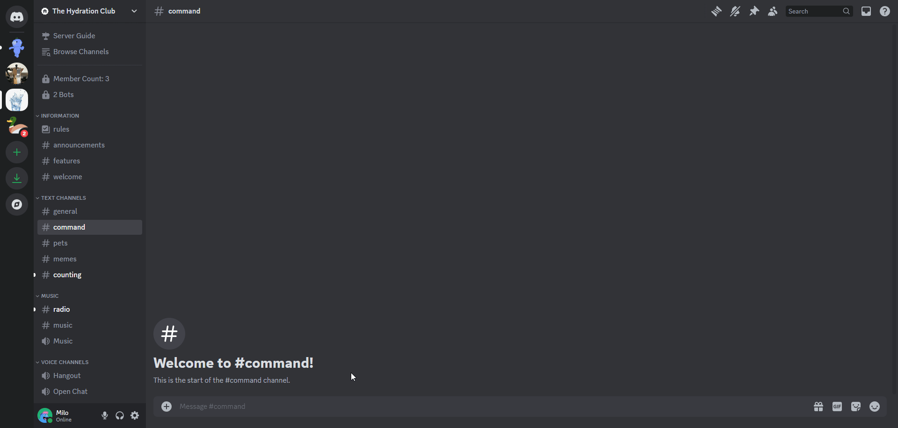

# Dice Rolling Command
Virtually roll one or more dice.

## /diceroll
The `/diceroll` command allows you to virtually roll a dice with a number of sides and a number of dice.

You can roll up to 10 dice of each type (`d4`, `d6`, `d8`, `d10`, `d12`, `d20`, `d100`).

Additionally, you can add a modifier to the roll using the `+` or `-` characters followed by a number.

:::info
For example:
- If you want to roll 2 D6s, you can type `/diceroll d6:2`
- If you want to roll 1 D6 and 1 D20, you can type `/diceroll d6:1 d20:1`
- If you want to roll 2 D4s, 1 D8, with a modifier of +2, you can type `/diceroll d4:2 d8:1 modifier:+2`
:::

