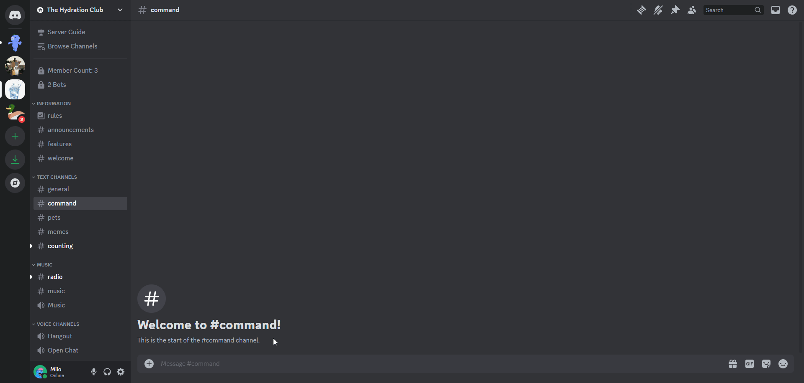

# PC Builder Command
Get a PC build recommendation based on your preferences.

## /pcbuilder
You can get a PC build recommendation by running the `/pcbuilder` command and typing in your preferences. Powered by [Newegg](https://www.newegg.com/tools/custom-pc-builder).

### Type
You can choose between a `PC for Gaming` or `PC for Graphic Design`.

### Budget
You can choose between the following budgets:
- $1,000 or less
- $1,300 or less
- $1,600 or less
- $2,000 or less
- $2,500 or less

### CPU
You can choose between an `Intel Core i5`, `Intel Core i7`, `Intel Core i9`, `Ryzen 5`, `Ryzen 7`, or `Ryzen 9`.

### GPU
You can choose between a `RTX-4070`, `RTX-4090`, `RTX-3060`, `RTX-3060Ti`, `RTX-3070Ti`, `RX6800`, or `RX6950XT`.

### Storage
You can choose between `512GB`, `1TB`, `2TB`, or `4TB` worth of storage.

### RAM
You can choose between `8GB`, `16GB`, or `32GB` worth of RAM.

### RAM Type
You can choose between `DDR4` or `DDR5` RAM.

### Cooling
You can choose between `Air Cooling` or `Liquid Cooling`.